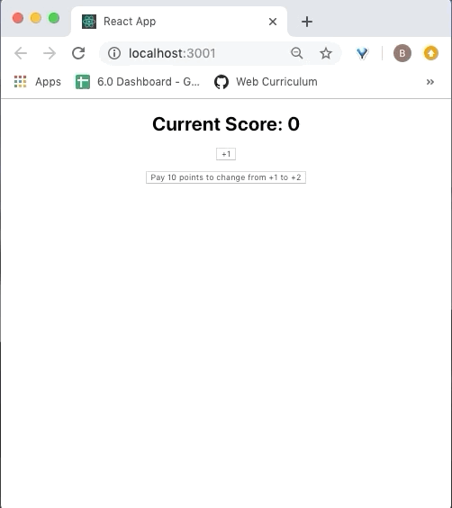

# React State Lab

Build a simple clicker "game" that makes use of React, props, and state!



---

## Lab Setup

### Getting started

1. Fork and clone this repository.

1. Navigate to the cloned repository's directory on your command line. Then, run the following command:

   ```
   npm install
   ```

   This will install the libraries needed to run the tests.

1. Open up the repository in VSCode. Follow the instructions below to complete the Lab.

### Tests

To run the tests, you can run the following command from the command line. You will need to be in the root directory of your local directory.

```
npm test
```

This will open the Cypress testing window, where you can click to run an individual suite of tests or all of the tests at once.

#### Testing Tips

Keep the following in mind for this lab as you run the tests.

1. While running your tests, you must have a server up and running in another terminal. This means you will have _both_ a terminal window running the actual React application _and_ a terminal window running the tests.

1. When creating a component, make sure to create and import it with the same name as the file name. For example, the component created and exported inside of the `Post.js` file should be `Post`. The tests look for these specific names.

1. While the `cypress-watch-and-reload` package has been installed in this project, sometimes the React application will take longer to reload than the tests. If you feel as though a test should be passing that isn't, try pressing the re-run button in the Cypress tests before asking for help.

## Instructions

You will be building an application that is similar to popular "clicker" games. The game has the following rules:

- Clicking the "+X" button will increase the score by `X`. The value of `X` starts at 1.
- If the user has at least 10 points and clicks the button "Pay 10 points to change from +X to +Y", the value of `X` will increase by 1. For example, at the beginning of the game the incrementor will be "+1". If you pay 10 points, the incrementor will change to "+2".
- If the user doesn't have 10 points but clicks the button "Pay 10 points to change from +X to +Y", an alert message will say "You can't afford that!"
- Once the user has accumulated 100 points, the game shows "You Win!" and allows the player to restart the game.

### Detailed list

The following is a list of more detailed requirements. As always, check the tests to see exactly what is being tested.

- Display the current score to the user, starting from a score of `0`
  - Use the _exact_ text: `Current Score: ` followed by the score
- Clicking a button increments the score by one
  - The button text should have the _exact_ text: `+1`
- Have a button where the user can spend `10` points to increase the value of each click by `1`
  - The button should have the _exact_ text: `Pay 10 points to change from +1 to +2`
  - Display an `alert` with the _exact_ text `You can't afford that!` if the user doesn't have enough points to spend
  - If the user has enough points, reduce the score by 10, and add `1` to points you add to your score each time you click the button.
  - The button text should change as well, for example from `+1` to `+2`
  - The pay button text should also update, for example from `Pay 10 points to change from +1 to +2` to `Pay 10 points to change from +2 to +3`
- When the user has `100` or more points, display a victory screen
  - There should be an `<h2>` element with the _exact_ text `You Win!`
  - There should be a button with the text `Play again?` (including the question mark)
    - Clicking on this button starts the game over again with a score of 0, a `+1` button, etc.
  - Keep the user's score on the screen
  - Do not show the buttons to add to the score or pay points.
